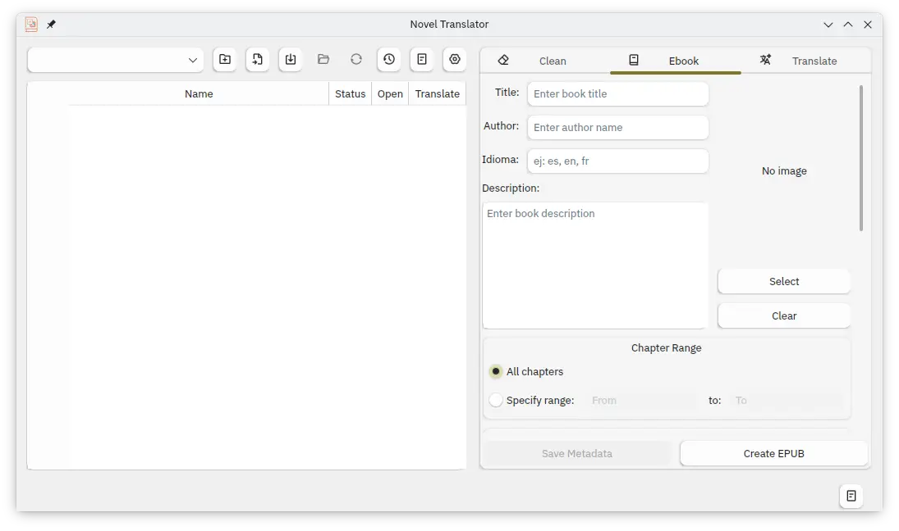
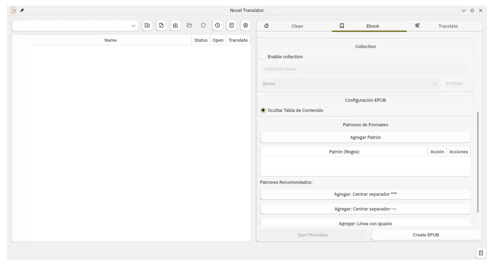

<div align="center">
  
  <h1>Novel Translator</h1>
  <p>
    <b>A comprehensive desktop application for managing, processing, and translating novels and text documents.</b>
  </p>
  <p>
    <i><a href="README_ES.md">README en Español</a> | <a href="README_ES.md">Leer en Español</a></i>
  </p>
</div>

A complete desktop application to manage, process, and translate novels and text documents. Designed specifically to handle large literary projects with support for multiple AI providers, advanced chapter management, ebook creation, EPUB importation, and intelligent text processing.

## 🚀 Motivations

I created this application because I have some novels that were translated to Spanish but with very poor quality. It's also useful for translating novels that don't yet have quality Spanish translations. I designed it to work alongside the LightNovel-Crawler tool (https://github.com/dipu-bd/lightnovel-crawler).

## ⭐ Key Features

### 📚 **Advanced Library Management**
- **Intelligent Folder Structure**: Automatic creation and maintenance of organized project directories (`originals/`, `translated/`)
- **Library Browser**: ComboBox integration for selecting novels from configured library directory
- **Recent Folders History**: Smart navigation with up to 10 recent projects and individual folder removal
- **Project Notes System**: Dedicated notes editor for each novel project with persistent storage
- **Book Metadata Management**: Title, author, description, and project notes with database persistence

### 🌐 **Advanced AI Translation Engine**


#### **Multi-Provider AI Support**
- **Google Gemini**: Flash and Flash Lite models
- **Hyperbolic**: GPT OSS 120B, Qwen3 80B A3B Thinking models
- **Chutes AI**: Mistral Small 3.2, Qwen3 235B A22B Thinking, GPT OSS 20B/120B, Ling 1T FP8, Hermes 4 70B
- **Mistral AI**: Magistral Small, Mistral Small with thinking capabilities

#### **Intelligent Text Processing**
- **Smart Segmentation**: Respects narrative structure, sentences, and paragraphs with backward search algorithm
- **Auto-Segmentation**: Automatically detects long texts (>10k chars) and segments intelligently
- **Manual Segmentation**: Configurable segment sizes (default 5000 chars)
- **Integrity Validation**: Ensures no content loss during segmentation with detailed reporting
- **Natural Cut Optimization**: Prioritizes paragraph breaks, sentence endings, and narrative structure

#### **Advanced Quality Assurance**
- **Dual Verification System**: Check and refine with optional separate providers/models
- **Automatic Retry Logic**: Re-translates entire text if verification fails
- **Custom Prompts**: Project-specific prompts for translation, check, and refine operations per language pair
- **Custom Terms Management**: Project-specific terminology with database persistence
- **Thinking Token Support**: Full support for AI models that use reasoning tokens

#### **Flexible Translation Configuration**
- **Session API Keys**: Temporary API keys for different providers in single session
- **Configurable Timeout**: Adjustable request timeouts (default 200s)
- **Progressive Translation**: Individual chapter translation with progress tracking
- **Database Prevention**: Avoids re-translations with intelligent file tracking

### 🧹 **Advanced Text Cleaning System**


#### **5 Powerful Cleaning Modes**
- **Delete After Text**: Remove content following specific patterns
- **Remove Duplicates**: Intelligent duplicate detection and removal
- **Delete Specific Lines**: Pattern-based line removal with regex support
- **Normalize Spacing**: Smart whitespace and formatting normalization
- **Find & Replace**: Advanced pattern-based text replacement

#### **Smart Processing Controls**
- **Range Selection**: Process specific chapters or entire projects
- **Preview & Backup**: Preview changes before applying with automatic backups
- **Batch Processing**: Handle multiple files efficiently

### 📚 ** EPUB Creation**



#### **Advanced Conversion Engine**
- **HTML to Markdown**: Professional conversion with BeautifulSoup processing
- **Chapter Processing**: Intelligent chapter detection and numbering
- **Cover Integration**: Automatic cover detection from multiple sources
- **Metadata Management**: Comprehensive book information handling
- **CSS Optimization**: Responsive design for e-readers
- **Custom Formatting Patterns**: Apply custom text formatting based on regex patterns (center, separator, italic)

#### **Smart Import System**
- **EPUB Import with Preview**: Preview chapters before import with chapter selection
- **TXT Chapters Import**: Batch import from source directories
- **Metadata Extraction**: Automatic title, author, and description detection

## 🔧 **Technical Architecture**

### **Hybrid Database System**
- **SQLite Primary**: Fast, ACID-compliant database for project data
- **JSON Backup**: Automatic JSON fallback for data persistence
- **Multi-Table Design**: Translations, custom terms, book metadata, custom prompts
- **Data Migration**: Automatic schema updates and data integrity

### **Intelligent Session Management**
- **Detailed Logging**: Comprehensive session logs with export capabilities
- **Error Recovery**: Robust retry mechanisms with exponential backoff
- **State Persistence**: Real-time status tracking across sessions
- **Performance Monitoring**: Rate limit control and resource management

### **Advanced UI Features**
- **System Theme Detection**: Automatic icon adaptation to light/dark themes
- **Responsive Design**: Optimized layouts for different screen sizes
- **Progress Tracking**: Real-time translation progress with status indicators
- **Color-Coded Status**: Visual chapter status with system-aware colors

## 🚀 **Quick Start**

### **Requirements**
- Python 3.8+
- UV (Python package manager)
- PyQt6>=6.0.0
- See [Installation](#installation) for full dependencies

### **Installation**

#### **Option 1: Standard Installation**
1. Clone the repository:
```bash
git clone https://github.com/mfloresz/novel-translator.git
cd novel-translator
```

2. Create virtual environment:
```bash
uv venv
source venv/bin/activate  # Linux/macOS
venv\Scripts\activate     # Windows
```

3. Install dependencies:
```bash
uv pip install .
```

4. Configure API keys (create `.env` file from `.env.example`)

5. Run the application:
```bash
uv run python main.py
```

#### **Option 2: Windows Installation**
For Windows users, automated installation scripts are provided:

1. Run `install.bat` to install the application in your user directory
2. Run `run_nt.bat` to start the application without showing the terminal

## 📋 **Usage Guide**

### **Basic Workflow**
1. **Setup**: Configure API keys and translation settings
2. **Import**: Load existing files or import from EPUB
3. **Process**: Clean text, translate chapters, or create EPUBs
4. **Export**: Generate professional ebooks

### **Advanced Translation Workflow**
1. **Configure Providers**: Set up multiple AI providers in settings
2. **Customize Prompts**: Create project-specific translation prompts
3. **Set Custom Terms**: Define terminology for consistent translations
4. **Smart Segmentation**: Enable auto-segmentation for large texts
5. **Quality Assurance**: Enable check and refine with separate models
6. **Batch Processing**: Translate multiple chapters with progress tracking

### **Interface Overview**
- **Main Panel**: File browser with status indicators and chapter management
- **Library Browser**: Quick access to organized novel collections
- **Recent Projects**: Smart navigation with folder management
- **Translate Tab**: Advanced translation configuration with multi-provider support
- **Clean Tab**: Comprehensive text cleaning operations
- **Ebook Tab**: Professional EPUB creation with metadata management

## ⚙️ **Configuration**

### **API Setup**
Create a `.env` file with your API keys:
```env
GOOGLE_GEMINI_API_KEY=your_gemini_key_here
HYPERBOLIC_API_KEY=your_hyperbolic_key_here
CHUTES_API_KEY=your_chutes_key_here
MISTRAL_API_KEY=your_mistral_key_here
```

### **Application Settings**
- **Location**: `src/config/config.json`
- **Provider Configuration**: Default provider, model, timeout settings
- **Language Settings**: Source/target languages with automatic detection
- **Segmentation**: Auto-segmentation thresholds and manual sizes
- **Check & Refine**: Separate providers/models for quality assurance
- **UI Language**: Interface language (English US, Spanish Mexico)

### **Customization Features**
- **Project-Specific Prompts**: Custom translation prompts per language pair
- **Custom Terms Database**: Terminology management with persistence
- **Book Metadata**: Comprehensive metadata storage and management
- **Session Logging**: Detailed logging with export capabilities

## 🔬 **Advanced Features**

### **Intelligent Text Processing**
- **Narrative-Aware Segmentation**: Respects story structure and character dialogues
- **Automatic Quality Verification**: AI-powered translation quality checking
- **Smart Retry Logic**: Complete re-translation on quality failure
- **Content Integrity Validation**: Ensures no data loss during processing

### **Professional Project Management**
- **Library Organization**: Systematic project categorization and access
- **Metadata Persistence**: Comprehensive book information storage
- **Progress Tracking**: Real-time translation progress with status persistence
- **Backup Systems**: Automatic data backup with recovery mechanisms

### **Enterprise-Grade Architecture**
- **Asynchronous Processing**: Background operations without UI blocking
- **Resource Management**: Intelligent rate limiting and timeout handling
- **Error Recovery**: Robust error handling with automatic retry mechanisms
- **Performance Optimization**: Optimized for large projects (100+ chapters)

## 📁 **Project Structure**
```
novel-translator/
├── src/
│   ├── gui/              # User Interface Components
│   │   ├── icons/        # Theme-aware SVG icons
│   │   ├── translate.py  # Advanced translation panel
│   │   ├── clean.py      # Text cleaning interface
│   │   ├── create.py     # EPUB creation panel
│   │   ├── settings_gui.py # Configuration interface
│   │   └── ...
│   ├── logic/            # Business Logic
│   │   ├── translator.py # Core translation engine
│   │   ├── database.py   # Hybrid database system
│   │   ├── epub_converter.py # EPUB processing
│   │   ├── session_logger.py # Detailed logging
│   │   └── ...
│   └── config/           # Configuration Files
│       ├── translation_models.json # AI provider models
│       ├── languages.json         # Language mappings
│       ├── i18n/                  # Interface translations
│       └── prompts/               # Custom prompt templates
├── main.py               # Application Entry Point
├── clean.sh              # Python cache cleanup
├── install.bat/.sh       # Platform-specific installers
└── run_nt.*              # Launch scripts
```

## 🌍 **Multilingual Support**
- **Interface Languages**: English (US), Spanish (Mexico)
- **Translation Languages**: Extensive language support with automatic detection
- **Custom Language Addition**: Create JSON files in `src/config/i18n/`
- **Regional Variants**: Support for language variants (es-MX, en-US, etc.)

## 🛡️ **Reliability & Performance**

### **Data Safety**
- **Automatic Backups**: SQLite with JSON backup for data integrity
- **Progress Persistence**: Translation progress saved in real-time
- **Error Recovery**: Graceful handling of network and processing errors
- **Data Validation**: Integrity checks for all database operations

### **Performance Optimization**
- **Memory Management**: Efficient handling of large text files
- **Network Optimization**: Intelligent retry logic and rate limiting
- **Processing Efficiency**: Asynchronous operations for responsive UI
- **Scalability**: Optimized for projects with hundreds of chapters

## 🔐 **Security & Privacy**
- **Local Processing**: All data processing happens locally
- **API Key Management**: Secure storage and temporary session keys
- **No Data Collection**: No user data transmitted to external servers
- **Project Isolation**: Each project maintains separate data and settings

## 📈 **Performance Metrics**
- **Large Project Support**: Optimized for 100+ chapter novels
- **Fast Processing**: Efficient text segmentation and batch operations
- **Memory Efficient**: Optimized memory usage for long texts
- **Network Resilient**: Robust handling of API timeouts and failures

## 🤝 **Integration & Compatibility**
- **LightNovel-Crawler**: Designed to work alongside the popular crawler
- **Standard Formats**: TXT, EPUB import/export with metadata preservation
- **Cross-Platform**: Linux, Windows, macOS compatibility
- **Flexible Output**: Multiple output formats with professional formatting

## 📝 **Logging & Monitoring**
- **Session Logging**: Detailed logs of all translation operations
- **Error Tracking**: Comprehensive error logging with context
- **Performance Metrics**: Processing time and resource usage tracking
- **Export Capabilities**: Log export for analysis and debugging

## 🚨 **Troubleshooting**

### **Common Issues**
- **API Key Errors**: Verify keys in `.env` file and provider settings
- **Import Problems**: Ensure EPUB files are not corrupted
- **Translation Failures**: Check network connectivity and API quotas
- **Performance Issues**: Adjust segmentation settings for large texts

### **Support Resources**
- **Configuration Validation**: Built-in settings validation and correction
- **Error Recovery**: Automatic retry mechanisms with configurable timeouts
- **Debug Logging**: Comprehensive logging for troubleshooting
- **Backup Recovery**: JSON backup system for data recovery

## ⚠️ **Disclaimer**
While this project works reliably, I cannot guarantee its functionality as it was created with the help of AI. The application includes comprehensive error handling and recovery mechanisms, but users should always backup their work regularly.

## 🔄 **Version History**
- **v1.0.0**: Initial release with full translation, cleaning, and EPUB creation features
- **Advanced Features**: Hybrid database, auto-segmentation, multi-provider support
- **Quality Assurance**: Check & refine with retry logic and separate models
- **Professional Tools**: Comprehensive project management and metadata handling

---

**Made with ❤️ for the novel translation community**
