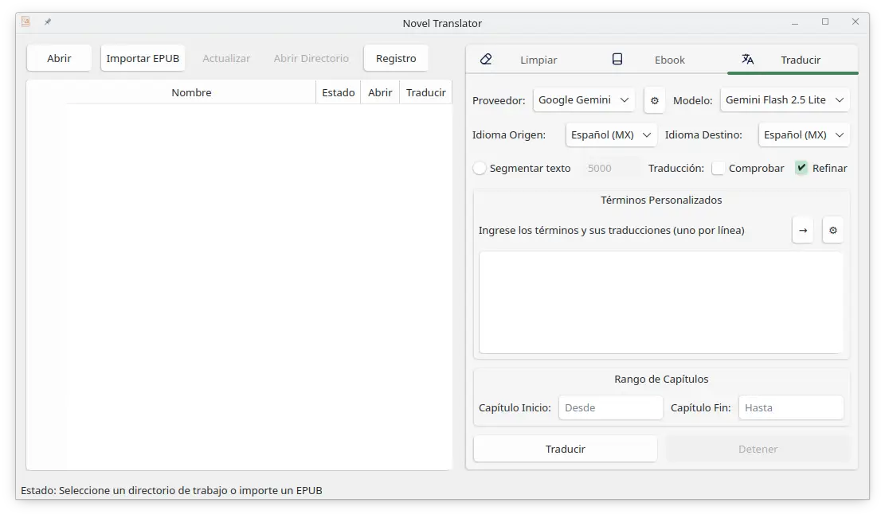
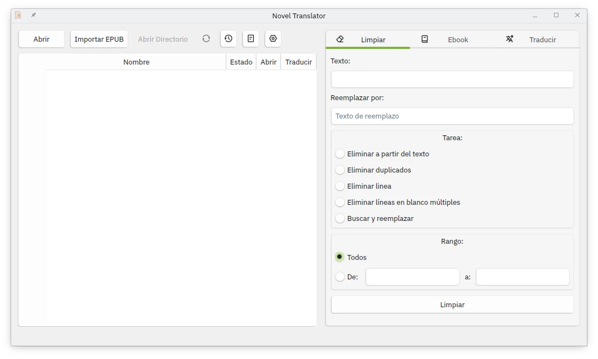
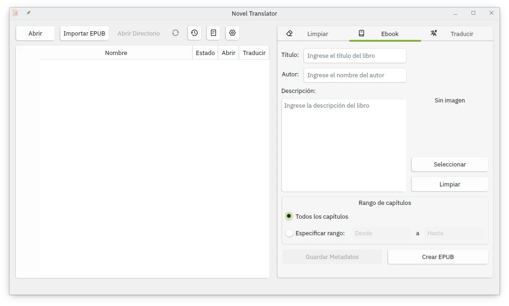

  
  <h1>Novel Manager</h1>
  

    <b>A comprehensive desktop application for managing, processing, and translating novels and text documents.</b>
  

  

    <i><a href="README_ES.md">README in Spanish</a>.</i>
  

A complete desktop application to manage, process, and translate novels and text documents. Designed specifically to handle large literary projects with support for multiple AI providers, advanced chapter management, ebook creation, and EPUB importation.

## Features

### File Management
- Intuitive graphical interface for file navigation and organization.
- **EPUB file import:** Converts existing EPUBs to text files for editing.
- **Automatic update:** "Update" button to synchronize the file list.
- Preview and quick access to documents.
- Support for text files (.txt).
- File status tracking system with identifying colors.
- **Metadata management:** Automatically saves and loads the project's title, author, and description.
- **Recent folders:** History system of visited directories for quick access.

### EPUB Import
- Automatic conversion of EPUB files to text files (.txt).
- Smart extraction of chapters and content.
- Preservation of the original narrative structure.
- Automatic creation of an organized directory.
- Validation of EPUB files before import.
- **Configurable import options:**
  - Add automatic numbering to content.
  - Insert chapter titles into the content.

### Advanced Automatic Translation

- **Multiple integrated AI providers:**
  - Google Gemini (Flash 2.5 Lite)
  - Chutes AI (Mistral Small 3.2, Skyfall V2)
  - Together AI (Llama 3.3 70B)
  - DeepInfra (Sao10K L3.3-70B-Euryale, Qwen 3 A3B)
  - OpenAI (GPT-4.1 Nano)
- **Multilingual support:**
  - Spanish (Mexico) with contextual translation.
  - English
  - Automatic language detection.
- **Advanced translation features:**
  - **Granular control of chapter range** (individual or in batches).
  - **Automatic quality check** with a retry system.
  - **Automatic refinement** to improve the quality of the translated text.
  - **Intelligent text segmentation** that respects sentences and paragraphs.
  - Automatic pause system between translations to avoid API limits.
  - Integrated database to avoid re-translations.
  - **Custom terms per project** with automatic persistence.
  - Individual translation per chapter from the main interface.
  - Detailed logging system for monitoring translations.

**Translate Tab:** Allows translating text files using translation APIs, with support for segmentation, revision, and refinement of the translation.

*   **API Key:** Enter the API key of the translation provider (loaded automatically from .env).
*   **Provider:** Select the translation API provider.
*   **Model:** Choose the specific translation model of the selected provider.
*   **Source Language:** Select the original language of the text to be translated.
*   **Target Language:** Define the language to which the text will be translated.
*   **Segment text:** Option to divide the text into smaller segments to optimize translation.
*   **Check translation:** Enables/disables automatic quality verification after translation.
*   **Refine translation:** Enables/disables automatic refinement to improve the quality of the initial translation.
*   **Custom Terms:** Enter specific terms with their translation to ensure consistency (saved automatically).
*   **Chapter Range:** Define the range of chapters to translate (from - to).
*   **Translate:** Starts the batch translation process.
*   **Stop:** Interrupts the ongoing process.

### File Cleaning

#### Cleaning Modes
1. **Delete content after specific text**
   - Deletes all file content from a specified text.
   - Useful for removing ads, notes, links.

2. **Delete duplicates**
   - Deletes duplicate sections that start with a marked text.

3. **Delete specific line**
   - Deletes lines that start with a certain text.

4. **Delete multiple blank lines**
   - Normalizes spacing by removing consecutive blank lines.

5. **Find and replace text**
   - Replaces all occurrences of a text with another.

#### Range Control
- Selective processing by chapter range (all or from - to).

#### Additional Features
- Preview before applying changes.
- Batch processing.
- Automatic backup of original files.
- Error recovery system.
- Operation logging.

### Ebook EPUB Creation

- **Professional conversion from TXT to EPUB** with a literary structure.
- **Advanced metadata management:**
  - Automatic saving and loading of title, author, and description.
  - Persistence between work sessions.
  - Synchronization with a local database.
- **Intelligent cover detection:**
  - Automatic search for files (cover.jpg, portada.png, etc.).
  - Support for multiple image formats.
  - Alternative manual selection.
- **Literary organization:**
  - Automatic chapter numbering.
  - Optimized navigation structure.
  - Professional and responsive CSS styles.
- **Complete metadata handling** with automatic backup.

**Ebook Tab:** Facilitates the creation of EPUBs from text files.

*   **Title:** Enter the book title (saved automatically per project).
*   **Author:** Enter the author's name (saved automatically per project).
*   **Description:** Enter the book's description or synopsis (saved automatically per project).
*   **Save Metadata:** Button to manually save the title, author, and description of the current project.
*   **Cover:**
    - Select image manually.
    - Automatic detection of covers (cover.jpg, portada.png, etc.).
    - Clear selected cover.
*   **Chapter Range:** With the option to include all chapters or define a specific one (from-to).
*   **Create EPUB:** Starts the EPUB generation with the provided settings.

## System Requirements

### Project Dependencies
`bash
pip install PyQt6>=6.0.0 beautifulsoup4>=4.12.0 pypub3>=2.0.8 requests>=2.28.0 python-dotenv>=1.0.0 Pillow>=10.0.0
`

## Installation

1. Clone the repository:
`bash
git clone https://github.com/Misael-Ponce/novel-manager.git
cd novel-manager
`

2. Create the virtual environment:
`bash
python -m venv venv
source venv/bin/activate  # Linux/macOS
venv\Scripts\activate     # Windows
`

3. Install the dependencies:
`bash
pip install -r requirements.txt
`

## Initial Setup

### API Key Configuration
Create a `.env` file in the project root with your API keys:
`env
# Google Gemini
GEMINI_API_KEY=your_google_gemini_key

# Chutes AI
CHUTES_API_KEY=your_chutes_ai_key

# Together AI
TOGETHER_API_KEY=your_together_ai_key

# DeepInfra
DEEPINFRA_API_KEY=your_deepinfra_key

# OpenAI
OPENAI_API_KEY=your_openai_key
`

### Application Configuration
The application uses JSON configuration files to customize its behavior:

- **[`src/config/config.json`](src/config/config.json)**: Main configuration (provider, model, languages, initial directory).
- **[`src/config/models/translation_models.json`](src/config/models/translation_models.json)**: Available models per provider.
- **[`src/config/languages.json`](src/config/languages.json)**: Language mapping for translation.

### Advanced Configuration
You can customize:
- Default translation provider and model.
- Source and target languages.
- Initial working directory.
- Segmentation size for long translations.
- User interface behavior.

## Usage

### Starting the Application
`bash
python main.py
`

### Recommended Workflow

#### 1. **Initial Setup**
- Configure your API keys in the `.env` file.
- Adjust the translation settings in **Settings > Configuration**.
- Select your preferred working directory.

#### 2. **Content Import**
**Option A: Import from EPUB**
- Click on "Import EPUB" and select your file.
- Choose import options (numbering, chapter titles).
- The application will automatically create an organized structure.

**Option B: Use existing files**
- Click on "Open" and select a folder with `.txt` files.
- The application will automatically detect and organize the chapters.

#### 3. **Project Management**
- **Update:** Synchronize manual changes in the files.
- **Open:** Access the full content of any chapter.
- **Visual status:** Colors indicate completed translations (green), errors (red), or pending (black).
- **Individual translation:** Translate specific chapters without affecting others.
- **Recent folders:** Quickly access recent projects using the "Recent folders" button.

#### 4. **Advanced Processing**
**Text Cleaning:**
- Delete content after specific text.
- Remove duplicates and unwanted lines.
- Bulk find and replace text.
- Normalize spaces and line breaks.

**Professional Translation:**
- Configure AI provider and model.
- Define custom terms per project.
- Activate segmentation for long texts.
- Enable quality check and refinement.
- Monitor progress with detailed logging.

#### 5. **Ebook Generation**
- **Smart metadata:** Title, author, and description are saved automatically.
- **Automatic cover:** Detection of cover images in multiple formats.
- **Professional structure:** Optimized navigation and responsive CSS styles.
- **Ready export:** Compatible with most e-readers.

### Advanced Technical Features

#### Hybrid Database System
- **Main SQLite:** Efficient storage of translations, custom terms, and metadata.
- **Automatic JSON backup:** Recovery system for database failures.
- **Transactional management:** Atomic operations for data integrity.
- **Optimized indexing:** Quick search for files and translations.

#### Smart State Management
- **Real-time color system:**
  - 🔴 **Error:** Problems in processing.
  - 🟢 **Translated:** Process completed successfully.
  - ⚫ **Pending:** Unprocessed or queued.
- **Automatic backup:** Persistence of states between sessions.
- **Change detection:** Synchronization with external modifications.

#### Performance Optimization
- **Asynchronous processing:** Background translations without blocking the interface.
- **Intelligent segmentation:** Algorithm that respects narrative structure when splitting long texts.
- **Memory management:** Optimized for large files (100+ chapters).
- **Translation cache:** Avoids unnecessary re-translations.

#### Logging and Monitoring System
- **Detailed session logging:** All operations recorded with timestamps.
- **API monitoring:** Tracking of token consumption and rate limits.
- **Error diagnosis:** Complete information for troubleshooting.
- **Log export:** Structured files for later analysis.

## Project Architecture

`
novel-manager/
│
├── 📁 src/
│   ├── 📁 gui/                          # User Interface
│   │   ├── 📄 clean.py                  # File cleaning panel
│   │   ├── 📄 create.py                 # EPUB creation panel
│   │   ├── 📄 translate.py              # Advanced translation panel
│   │   ├── 📄 settings_gui.py           # Configuration dialog
│   │   └── 📁 icons/                    # Application visual resources
│   │
│   ├── 📁 logic/                        # Business Logic
│   │   ├── 📄 cleaner.py                # Text processing
│   │   ├── 📄 creator.py                # EPUB generation
│   │   ├── 📄 database.py               # Hybrid database management
│   │   ├── 📄 epub_importer.py          # EPUB import
│   │   ├── 📄 functions.py              # Utilities and validations
│   │   ├── 📄 get_path.py               # Directory selection
│   │   ├── 📄 loader.py                 # File and metadata loading
│   │   ├── 📄 session_logger.py         # Logging system
│   │   ├── 📄 translation_manager.py    # Translation management
│   │   ├── 📄 translator.py             # Translation engine
│   │   └── 📄 translator_req.py         # API communication
│   │
│   ├── 📁 config/                       # Configuration
│   │   ├── 📄 config.json               # Main configuration
│   │   ├── 📄 languages.json            # Language mapping
│   │   ├── 📁 models/
│   │   │   └── 📄 translation_models.json # Available AI models
│   │   └── 📁 prompts/
│   │       ├── 📄 translation.txt       # Translation template
│   │       ├── 📄 check.txt             # Verification template
│   │       └── 📄 refine.txt            # Refinement template
│   │
│   └── 📁 resources/                    # Additional resources
│       └── 📄 preset_terms.json         # Predefined terms
│
├── 📄 .env                              # Environment variables (API keys)
├── 📄 .env.example                      # Environment variable template
├── 📄 main.py                           # Main entry point
├── 📄 requirements.txt                  # Project dependencies
├── 📄 install.sh                        # Installation script
├── 📄 run_nv.sh                         # Execution script
└── 📄 README.md                         # Complete documentation
`

### Main Components

#### 🎯 User Interface (GUI)
- **PyQt6:** Modern framework for desktop applications.
- **Automatic theme detection:** Support for light/dark system themes.
- **Responsive interface:** Design adaptable to different screen sizes.
- **Themed icons:** Icon system that adapts to the system theme.

#### ⚙️ Translation Engine
- **Multi-provider:** Support for multiple AI APIs.
- **Intelligent segmentation:** Advanced algorithm that preserves narrative structure.
- **Quality system:** Automatic checking and refinement.
- **Error management:** Robust system with retries and logging.

#### 💾 Data Management
- **Hybrid database:** SQLite + automatic JSON backup.
- **Persistence:** All data is saved automatically.
- **Integrity:** Transaction system for critical data.
- **Performance:** Optimized indexing for large data volumes.

#### 🔌 API Integration
- **Modular abstraction:** Design that facilitates adding new providers.
- **Rate limit handling:** Automatic control of requests.
- **Consumption monitoring:** Tracking of tokens and costs.
- **Fallback system:** Handling of network and API errors.

## Additional Features

### 🚀 Highlighted Functionalities

#### 📂 Recent Folders System
- **Automatic history:** The application automatically saves the last 10 visited directories.
- **Quick access:** "Recent folders" button in the main interface to browse previous projects.
- **Intuitive management:**
  - Display of folder names with tooltips showing full paths.
  - Delete button (×) to remove specific folders from history.
  - Automatic update when selecting a recent folder.
- **Persistence:** Recent folders are saved in `src/config/recents.json` between sessions.
- **Functionality:** When selecting a recent folder, the application automatically loads it as the current working directory.

#### 📚 Advanced EPUB Import System
- **Comprehensive validation:** Verifies structure and content before importing.
- **Intelligent extraction:** Converts chapters to sequentially numbered .txt files.
- **Narrative preservation:** Maintains original structure and organization.
- **Automatic metadata:** Extracts title, author, and description from the original EPUB.
- **Intelligent cover:** Automatic detection of cover images.

#### 🔄 Intelligent Synchronization System
- **Real-time change detection:** Monitors external modifications.
- **Complete preservation:** Maintains states, translations, and metadata.
- **Dynamic management:** Detects new, deleted, or modified files.
- **Automatic readjustment:** Maintains consistency in numbering and states.

#### 📊 Advanced Metadata Management
- **Multi-level system:** Title, author, description with full persistence.
- **Global synchronization:** Consistent metadata throughout the application.
- **Import/export:** Compatibility with EPUB standards.
- **Change history:** Tracking of metadata modifications.

#### ⚡ High-Performance Translation System
- **Multi-provider engine:** Support for multiple AI APIs simultaneously.
- **Narrative segmentation:** Advanced algorithm that respects story structure.
- **3-level quality system:**
  1. **Initial translation** with optimized prompts.
  2. **Automatic refinement** to improve quality.
  3. **Final verification** with cross-validation.
- **Intelligent resource management:**
  - Automatic rate limit control.
  - Retry system with exponential backoff.
  - Token consumption monitoring.
  - Strategic pauses between requests.

#### 🔧 Flexible Configuration System
- **Per-project configuration:** Each project can have its own configuration.
- **Predefined templates:** Optimized settings for different text types.
- **Hot-swapping:** Configuration changes without restarting the application.
- **Automatic backup:** All settings are saved automatically.

#### 📈 Monitoring and Diagnosis System
- **Structured logging:** Detailed recording of all operations.
- **Performance metrics:** Processing times, resource consumption.
- **Automatic diagnosis:** Detection and reporting of common problems.
- **Report export:** Generation of detailed reports for analysis.

#### 🛡️ Backup and Recovery System
- **Hybrid database:** SQLite + automatic JSON backup.
- **Recovery points:** Checkpoint system for long operations.
- **Failure recovery:** Automatic recovery mechanisms for errors.
-- **Data integrity:** Automatic verification and repair of corrupt data.