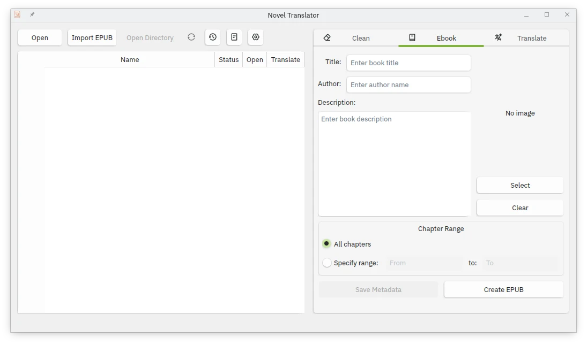

<h1 align="center">
  
</h1>

# Novel Translator

Una aplicación de escritorio para gestionar, procesar y traducir novelas y documentos de texto, con funcionalidades específicas para el manejo de capítulos, creación de ebooks e importación de EPUBs.

## Características

### Gestión de Archivos
- Interfaz gráfica intuitiva para navegación y organización de archivos
- **Importación de archivos EPUB:** Convierte EPUBs existentes a archivos de texto para edición
- **Actualización automática:** Botón "Actualizar" para sincronizar la lista de archivos
- Vista previa y acceso rápido a documentos
- Soporte para archivos de texto (.txt)
- Sistema de seguimiento del estado de los archivos con colores identificativos
- **Gestión de metadatos:** Guarda y carga automáticamente título y autor del proyecto

### Importación de EPUB
- Conversión automática de archivos EPUB a archivos de texto (.txt)
- Extracción inteligente de capítulos y contenido
- Preservación de la estructura narrativa original
- Creación automática de directorio organizado
- Validación de archivos EPUB antes de la importación

### Traducción Automática


- Integración con APIs de traducción:
  - Google Gemini (Flash 2.0, Flash 2.0 Lite, Flash 2.0 Exp)
  - Together AI (Qwen3-235B, Llama 3.3 70B)
  - DeepInfra (Sao10K L3.3-70B-Euryale, Gemma 3 27B)
  - OpenAI (GPT-4.1 Nano)
- Soporte para múltiples idiomas:
  - Español (Neutro)
  - Inglés
  - Francés
  - Alemán
  - Italiano
- Funciones avanzadas:
  - Control de rango de capítulos
  - **Comprobación automática de calidad de traducción**
  - Sistema de pausas automáticas entre traducciones
  - Base de datos para registro de traducciones y términos personalizados
  - **Segmentación inteligente de texto** para optimizar traducciones largas
  - Gestión de errores y recuperación
  - **Traducción individual por capítulo** desde la tabla principal

**Pestaña Traducir:** Permite traducir archivos de texto utilizando APIs de traducción, con soporte para segmentación y revisión de la traducción.

*   **API Key:** Ingresa la clave de la API del proveedor de traducción (se carga automáticamente desde .env).
*   **Proveedor:** Selecciona el proveedor de la API de traducción.
*   **Modelo:** Elige el modelo de traducción específico del proveedor seleccionado.
*   **Idioma Origen:** Selecciona el idioma original del texto a traducir.
*   **Idioma Destino:** Define el idioma al que se traducirá el texto.
*   **Segmentar texto:** Opción para dividir el texto en segmentos más pequeños para optimizar la traducción.
*   **Habilitar comprobación de traducción:** Activa/desactiva la verificación automática de calidad.
*   **Términos Personalizados:** Ingresa términos específicos con su traducción para garantizar coherencia (se guardan automáticamente).
*   **Rango de Capítulos:** Define el rango de capítulos a traducir (desde - hasta).
*   **Traducir:** Inicia el proceso de traducción por lotes.
*   **Detener:** Interrumpe el proceso en curso.

### Limpieza de Archivos


#### Modos de Limpieza
1. **Eliminar contenido después de texto específico**
   - Elimina todo el contenido del archivo a partir de un texto indicado
   - Útil para eliminar anuncios, notas, enlaces

2. **Eliminar duplicados**
   - Elimina secciones duplicadas que comienzan en un texto marcado

3. **Eliminar línea específica**
   - Elimina líneas que empiezan con un texto determinado

4. **Eliminar líneas en blanco múltiples**
   - Normaliza el espaciado eliminando líneas en blanco consecutivas

5. **Buscar y reemplazar texto**
   - Reemplaza todas las ocurrencias de un texto por otro

#### Control de Rango
- Procesamiento selectivo por rango de capítulos (todos o de - a)

#### Características adicionales
- Vista previa antes de aplicar cambios
- Procesamiento por lotes
- Respaldo automático de archivos originales
- Sistema de recuperación ante errores
- Registro de operaciones

### Creación de EPUB

- Conversión de archivos de texto a EPUB
- **Gestión inteligente de metadatos:** Guardado y carga automática de título y autor
- Soporte para imágenes de portada con detección automática
- Numeración automática de capítulos
- Estilos CSS predefinidos y optimizados
- **Preservación de metadatos entre sesiones**

**Pestaña Ebook:** Facilita la creación de EPUBs a partir de los archivos de texto.

*   **Título:** Introduce el título del libro (se guarda automáticamente por proyecto).
*   **Autor:** Ingresa el nombre del autor (se guarda automáticamente por proyecto).
*   **Guardar Metadatos:** Botón para guardar manualmente título y autor del proyecto actual.
*   **Portada:**
    - Seleccionar imagen manualmente
    - Detección automática de portadas (cover.jpg, portada.png, etc.)
    - Limpiar portada seleccionada
*   **Rango de Capítulos:** Con opción de incluir todos los capítulos o definir uno específico (desde-hasta).
*   **Crear EPUB:** Inicia la generación del EPUB con las configuraciones proporcionadas.

## Requisitos

### Dependencias
```bash
pip install PyQt6 beautifulsoup4 pypub3 requests python-dotenv Pillow
```

### Sistemas Operativos
- Windows
- Linux (KDE, GNOME)
- macOS

## Instalación

1. Clona el repositorio:
```bash
git clone https://github.com/usuario/novel-manager.git
cd novel-manager
```

2. Crea el entorno virtual:
```bash
python -m venv venv
source venv/bin/activate  # Linux/macOS
venv\Scripts\activate     # Windows
```

3. Instala las dependencias:
```bash
pip install -r requirements.txt
```

## Configuración

Añade tus claves API en el archivo `.env` en la raíz del proyecto:
```env
GEMINI_API_KEY=tu_clave_google_gemini
TOGETHER_API_KEY=tu_clave_together_ai
DEEPINFRA_API_KEY=tu_clave_deepinfra
OPENAI_API_KEY=tu_clave_openai
```

## Uso

### Iniciar la aplicación
```bash
python main.py
```

### Flujo de trabajo básico

1. **Seleccionar o Importar Contenido**
   - **Navegar:** Usa el botón "Navegar" para escoger una carpeta con archivos `.txt`.
   - **Importar EPUB:** Usa "Importar EPUB" para convertir un archivo EPUB existente a archivos de texto editables.
   - Los archivos se cargarán automáticamente, mostrando su estado con colores identificativos.

2. **Gestión de Archivos**
   - **Actualizar:** Usa el botón "Actualizar" si modificas archivos manualmente fuera de la aplicación.
   - **Abrir:** Haz clic en "Abrir" en cualquier fila para ver el contenido del capítulo.
   - **Traducir individual:** Usa el botón "Traducir" de cada fila para traducir capítulos específicos.

3. **Limpiar Archivos**
   - En la pestaña "Limpiar", selecciona modo y rango.
   - Ajusta opciones específicas según el tipo de limpieza.
   - Presiona "Limpiar" para aplicar cambios.

4. **Traducir**
   - En la pestaña "Traducir", las API keys se cargan automáticamente.
   - Configura proveedor, modelo, idiomas origen y destino.
   - Define rango de capítulos y términos personalizados.
   - Habilita/deshabilita la comprobación automática de calidad.
   - Usa segmentación para textos largos.
   - Presiona "Traducir" para procesar por lotes o usa los botones individuales en la tabla.

5. **Crear EPUB**
   - En la pestaña "Ebook", los metadatos se cargan automáticamente si existen.
   - Ingresa o modifica título y autor.
   - Usa "Guardar Metadatos" para preservar la información del proyecto.
   - La portada se detecta automáticamente o se puede seleccionar manualmente.
   - Define el rango de capítulos o selecciona todos.
   - Presiona "Crear EPUB" para generar el libro electrónico.

### Características Avanzadas

#### Base de Datos Integrada
- **Registro de traducciones:** Evita retraducir archivos ya procesados.
- **Términos personalizados:** Se guardan automáticamente por proyecto.
- **Metadatos del libro:** Título y autor se preservan entre sesiones.
- **Respaldo JSON:** Sistema de recuperación si SQLite falla.

#### Estados de Archivos
- **Sin procesar:** Archivos nuevos o no traducidos (texto negro).
- **Traducido:** Archivos procesados exitosamente (texto verde).
- **Error:** Archivos con problemas en el procesamiento (texto rojo).

#### Funciones de Productividad
- **Detección automática de portadas:** Busca archivos como cover.jpg, portada.png automáticamente.
- **Carga automática de API keys:** Las claves se cargan desde el archivo .env según el proveedor.
- **Segmentación inteligente:** Divide textos largos respetando oraciones y párrafos.
- **Comprobación de calidad:** Verifica automáticamente la calidad de las traducciones.
- **Actualización de listas:** Sincroniza la interfaz con cambios manuales en archivos.

## Estructura del Proyecto

```
novel-manager/
│
├── src/
│   ├── gui/
│   │   ├── clean.py           # Interfaz de limpieza
│   │   ├── create.py          # Interfaz creación EPUB (con gestión de metadatos)
│   │   ├── translate.py       # Interfaz traducción (con validación y segmentación)
│   │   └── icons/             # Iconos de la aplicación
│   │
│   └── logic/
│       ├── cleaner.py         # Lógica de limpieza de archivos
│       ├── creator.py         # Lógica de creación EPUB
│       ├── database.py        # Sistema de base de datos (SQLite + JSON backup)
│       ├── epub_importer.py   # Importador de archivos EPUB
│       ├── functions.py       # Funciones auxiliares y validaciones
│       ├── get_path.py        # Selección de directorio multiplataforma
│       ├── loader.py          # Carga de archivos y metadatos
│       ├── prompt_base.txt    # Plantilla de prompts para traducción
│       ├── prompt_check.txt   # Plantilla para verificación de traducciones
│       ├── translation_manager.py # Gestión de traducciones por lotes
│       ├── translation_models.json # Configuración de APIs y modelos
│       ├── translator.py      # Lógica principal de traducción
│       └── translator_req.py  # Manejador de requests a APIs
│
├── .env                       # Variables de entorno (API keys)
├── main.py                    # Entrada principal de la aplicación
├── requirements.txt           # Dependencias del proyecto
└── README.md                  # Documentación completa
```

## Funciones Adicionales

### Importación de EPUB
- **Validación previa:** Verifica la integridad del archivo EPUB antes de importar.
- **Extracción de contenido:** Convierte capítulos a archivos .txt numerados secuencialmente.
- **Preservación de estructura:** Mantiene la organización narrativa original.
- **Creación de directorio:** Genera automáticamente una carpeta organizada para el proyecto.

### Sistema de Actualización
- **Sincronización automática:** El botón "Actualizar" detecta cambios manuales en archivos.
- **Preservación de estados:** Mantiene información de traducciones y metadatos al actualizar.
- **Detección de archivos eliminados:** Actualiza la tabla eliminando referencias a archivos inexistentes.
- **Reajuste de rangos:** Los números de capítulo se mantienen consistentes tras los cambios.

### Gestión de Metadatos Inteligente
- **Carga automática:** Los metadatos se cargan automáticamente al abrir un proyecto.
- **Guardado persistente:** Título y autor se preservan en la base de datos local.
- **Sincronización entre pestañas:** Los metadatos son consistentes en toda la aplicación.
- **Respaldo múltiple:** Información guardada tanto en SQLite como en JSON.
