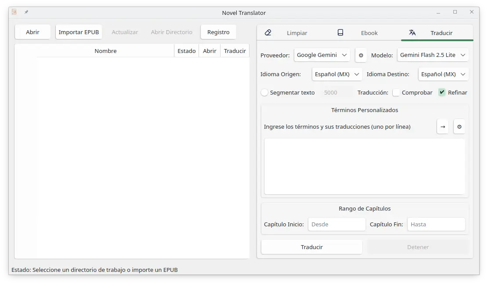
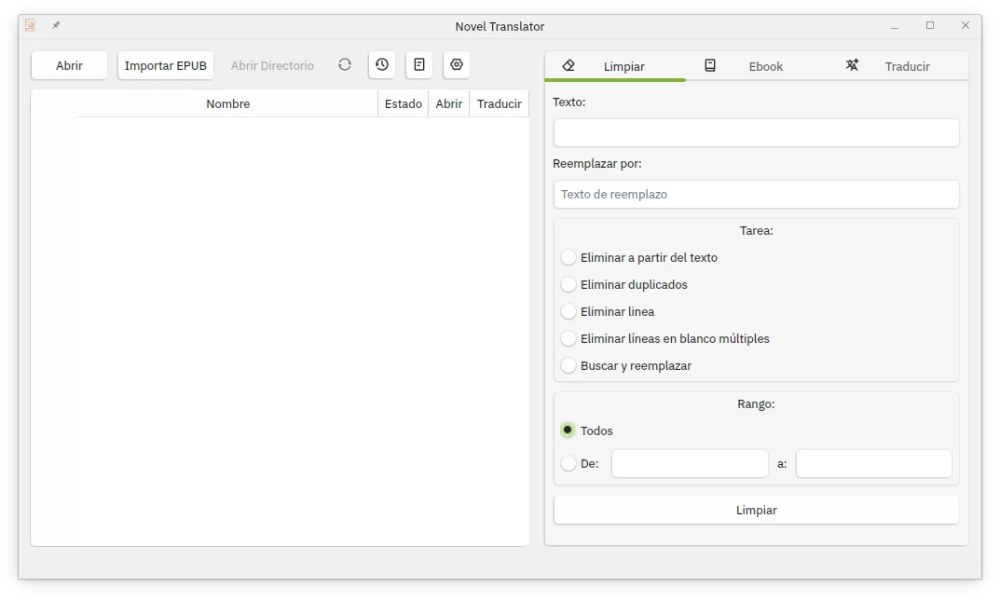
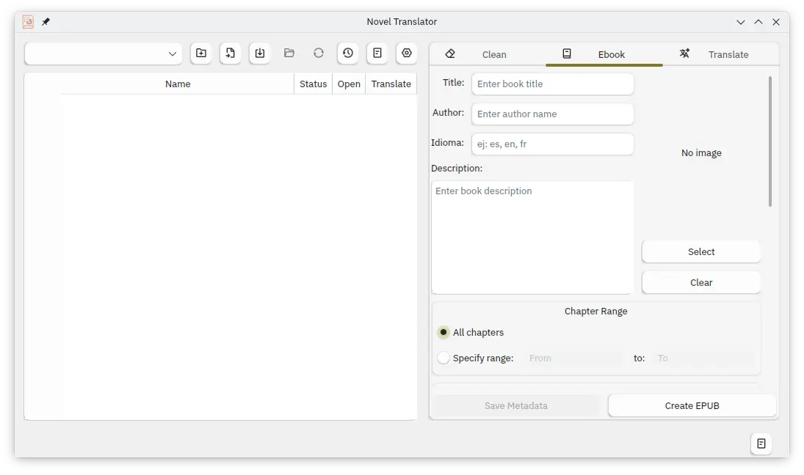
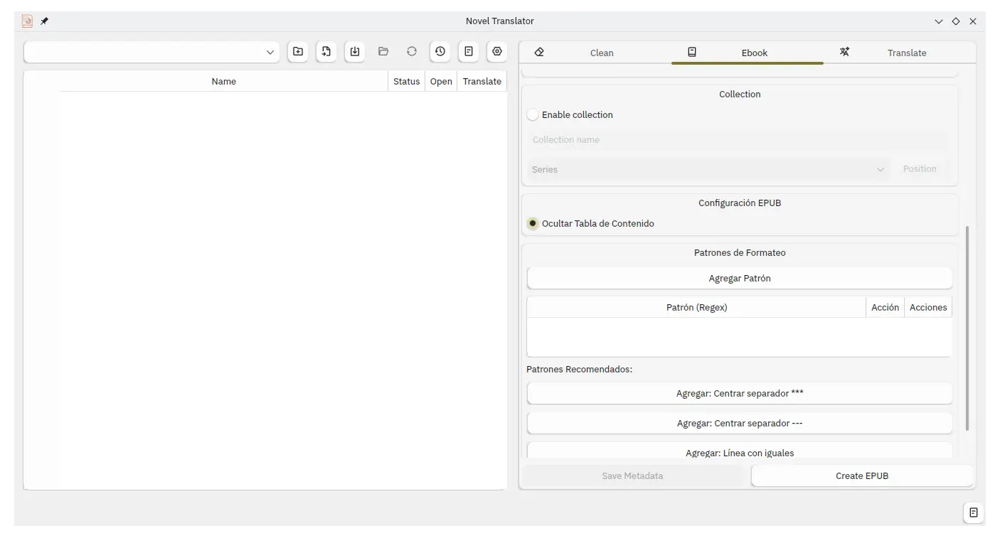

<div align="center">
  
  <h1>Novel Translator</h1>
  <p>
    <b>Una aplicación de escritorio completa para gestionar, procesar y traducir novelas y documentos de texto.</b>
  </p>
  <p>
    <i><a href="README.md">English Version</a> | <a href="README.md">Read in English</a></i>
  </p>
</div>

Una aplicación de escritorio completa para gestionar, procesar y traducir novelas y documentos de texto. Diseñada específicamente para manejar proyectos literarios grandes con soporte para múltiples proveedores de IA, gestión avanzada de capítulos, creación de ebooks, importación de EPUBs y procesamiento inteligente de texto.

## 🚀 Motivaciones

Lo hice porque tengo algunas novelas que aunque se tradujeron al español la calidad era muy mala y también para traducir novelas que aún no hay traducciones de calidad al español. Me sirve para usarla junto con la herramienta LightNovel-Crawler (https://github.com/dipu-bd/lightnovel-crawler).

## ⭐ Características Principales

### 📚 **Gestión Avanzada de Biblioteca**
- **Estructura de Carpetas Inteligente**: Creación y mantenimiento automático de directorios de proyecto organizados (`originals/`, `translated/`)
- **Navegador de Biblioteca**: Integración ComboBox para seleccionar novelas desde directorio de biblioteca configurado
- **Historial de Carpetas Recientes**: Navegación inteligente con hasta 10 proyectos recientes y eliminación individual de carpetas
- **Sistema de Notas por Proyecto**: Editor de notas dedicado para cada proyecto de novela con almacenamiento persistente
- **Gestión de Metadatos del Libro**: Título, autor, descripción y notas del proyecto con persistencia en base de datos

### 🌐 **Motor de Traducción IA Avanzado**


#### **Soporte Multi-Proveedor IA**
- **Google Gemini**: Modelos Flash y Flash Lite
- **Hyperbolic**: Modelos GPT OSS 120B, Qwen3 80B A3B Thinking
- **Chutes AI**: Mistral Small 3.1/3.2, GPT OSS 120B, DeepSeek 3.1/3.2, Xiaomi MiMo, Qwen3 80B A3B
- **Mistral AI**: Ministral 8B, Mistral Small, Mistral Creative
- **OpenRouter**: Grok 4.1 Fast, GPT OSS 120B, Mistral Small 3.2, Gemini Flash Lite
- **OpenAI**: GPT 5 Mini
- **OpenCode GO**: DeepSeek V4 Flash, MiMo 2.5, Qwen 3.5 Plus
- **Deepinfra**: Mistral Small, DeepSeek 3.2

#### **Procesamiento Inteligente de Texto**
- **Segmentación Inteligente**: Respeta estructura narrativa, oraciones y párrafos con algoritmo de búsqueda hacia atrás
- **Auto-Segmentación**: Detecta automáticamente textos largos (>10k caracteres) y segmenta inteligentemente
- **Segmentación Manual**: Tamaños de segmento configurables (por defecto 5000 caracteres)
- **Validación de Integridad**: Asegura que no hay pérdida de contenido durante la segmentación con reporte detallado
- **Optimización de Cortes Naturales**: Prioriza saltos de párrafo, finales de oración y estructura narrativa

#### **Aseguramiento de Calidad Avanzado**
- **Sistema de Verificación Dual**: Comprobar y refinar con proveedores/modelos opcionales separados
- **Lógica de Reintento Automático**: Re-traduce todo el texto si la verificación falla
- **Prompts Personalizados**: Prompts específicos por proyecto para operaciones de traducción, verificación y refinamiento por par de idiomas
- **Gestión de Términos Personalizados**: Terminología específica por proyecto con persistencia en base de datos
- **Soporte para Thinking Tokens**: Soporte completo para modelos IA que usan tokens de razonamiento

#### **Configuración Flexible de Traducción**
- **Claves API de Sesión**: Claves API temporales para diferentes proveedores en una sola sesión
- **Timeout Configurable**: Timeouts de solicitud ajustables (por defecto 200s)
- **Traducción Progresiva**: Traducción de capítulos individuales con seguimiento de progreso
- **Prevención de Base de Datos**: Evita re-traducciones con seguimiento inteligente de archivos

### 🧹 **Sistema Avanzado de Limpieza de Texto**


#### **5 Modos de Limpieza Poderosos**
- **Eliminar Después del Texto**: Remover contenido que sigue patrones específicos
- **Remover Duplicados**: Detección y eliminación inteligente de duplicados
- **Eliminar Líneas Específicas**: Remoción de líneas basada en patrones con soporte regex
- **Normalizar Espaciado**: Normalización inteligente de espacios en blanco y formato
- **Buscar y Reemplazar**: Reemplazo avanzado de texto basado en patrones

#### **Controles de Procesamiento Inteligentes**
- **Selección de Rango**: Procesar capítulos específicos o proyectos completos
- **Vista Previa y Respaldo**: Previsualizar cambios antes de aplicar con respaldos automáticos
- **Procesamiento por Lotes**: Manejo eficiente de múltiples archivos

### 📚 **Creación de EPUB**



#### **Motor de Conversión Avanzado**
- **HTML a Markdown**: Conversión profesional con procesamiento BeautifulSoup
- **Procesamiento de Capítulos**: Detección inteligente de capítulos y numeración
- **Integración de Portadas**: Detección automática de portadas desde múltiples fuentes
- **Gestión de Metadatos**: Manejo integral de información del libro
- **Optimización CSS**: Diseño responsivo para lectores electrónicos
- **Patrones de Formateo Personalizados**: Aplicar formato personalizado al texto basado en patrones regex (centrar, separador, cursiva)

#### **Sistema de Importación Inteligente**
- **Importación EPUB con Vista Previa**: Vista previa de capítulos antes de importar con selección de capítulos
- **Importación de Capítulos TXT**: Importación por lotes desde directorios fuente
- **Extracción de Metadatos**: Detección automática de título, autor y descripción

## 🔧 **Arquitectura Técnica**

Consulta [docs/CODEMAPS/INDEX.md](docs/CODEMAPS/INDEX.md) para la documentación completa de la arquitectura, incluyendo codemaps detallados de cada subsistema.

### **Sistema de Base de Datos Híbrida**
- **SQLite Primaria**: Base de datos rápida y compatible con ACID para datos del proyecto
- **Respaldo JSON**: Respaldo JSON automático para persistencia de datos
- **Diseño Multi-Tabla**: Traducciones, términos personalizados, metadatos de libro, prompts personalizados
- **Migración de Datos**: Actualizaciones automáticas de esquema e integridad de datos

### **Gestión Inteligente de Sesiones**
- **Registro Detallado**: Registros integrales de sesión con capacidades de exportación
- **Recuperación de Errores**: Mecanismos robustos de reintento con retroceso exponencial
- **Persistencia de Estado**: Seguimiento de estado en tiempo real a través de sesiones
- **Monitoreo de Rendimiento**: Control de límites de velocidad y gestión de recursos

### **Trabajadores en Segundo Plano**
- **TranslationWorker** (QThread): Traducción por lotes secuencial con soporte de detención
- **RefineWorker** (QThread): Refinamiento basado en herramientas con function calling
- **EpubImportWorker** (QRunnable): Importación de EPUB mediante thread pool

### **Características Avanzadas de UI**
- **Detección de Tema del Sistema**: Adaptación automática de iconos a temas claro/oscuro
- **Diseño Responsivo**: Diseños optimizados para diferentes tamaños de pantalla
- **Seguimiento de Progreso**: Progreso de traducción en tiempo real con indicadores de estado
- **Estado Codificado por Colores**: Estado visual de capítulos con colores conscientes del sistema

## 🚀 **Guía Rápida**

### **Requisitos**
- Python 3.8+
- UV (gestor de paquetes de Python)
- PyQt6>=6.0.0
- Ver [Instalación](#instalación) para dependencias completas

### **Instalación**

#### **Opción 1: Instalación Estándar**
1. Clonar el repositorio:
```bash
git clone https://github.com/mfloresz/novel-translator.git
cd novel-translator
```

2. Crear entorno virtual:
```bash
uv venv
source venv/bin/activate  # Linux/macOS
venv\Scripts\activate     # Windows
```

3. Instalar dependencias:
```bash
uv pip install .
```

4. Configurar claves API (crear archivo `.env` desde `.env.example`)

5. Ejecutar la aplicación:
```bash
uv run python main.py
```

#### **Opción 2: Instalación en Windows**
Para usuarios de Windows, se proporcionan scripts de instalación automatizada:

1. Ejecutar `install.bat` para instalar la aplicación en el directorio de usuario
2. Ejecutar `run_nt.bat` para iniciar la aplicación sin mostrar la terminal

## 📋 **Guía de Uso**

### **Flujo de Trabajo Básico**
1. **Configuración**: Configurar claves API y ajustes de traducción
2. **Importación**: Cargar archivos existentes o importar desde EPUB
3. **Procesamiento**: Limpiar texto, traducir capítulos o crear EPUBs
4. **Exportación**: Generar ebooks profesionales

### **Flujo de Trabajo Avanzado de Traducción**
1. **Configurar Proveedores**: Configurar múltiples proveedores IA en ajustes
2. **Personalizar Prompts**: Crear prompts de traducción específicos por proyecto
3. **Establecer Términos Personalizados**: Definir terminología para traducciones consistentes
4. **Segmentación Inteligente**: Habilitar auto-segmentación para textos grandes
5. **Aseguramiento de Calidad**: Habilitar verificar y refinar con modelos separados
6. **Procesamiento por Lotes**: Traducir múltiples capítulos con seguimiento de progreso

### **Flujo de Trabajo Avanzado de Refinamiento**
1. **Seleccionar Archivo(s)**: Elegir capítulos traducidos que necesiten refinamiento
2. **Configurar**: Establecer un proveedor/modelo separado con soporte de tools (function calling)
3. **Refinar**: Aplicar mejoras quirúrgicas al texto mediante operaciones de reemplazo, eliminación o inserción
4. **Verificar**: Revisar cambios aplicados solo donde sea necesario

### **Vista General de la Interfaz**
- **Panel Principal**: Navegador de archivos con indicadores de estado y gestión de capítulos
- **Navegador de Biblioteca**: Acceso rápido a colecciones de novelas organizadas
- **Proyectos Recientes**: Navegación inteligente con gestión de carpetas
- **Pestaña Traducir**: Configuración avanzada de traducción con soporte multi-proveedor
- **Pestaña Refinar**: Refinamiento de calidad basado en tools con function calling
- **Pestaña Limpiar**: Operaciones integrales de limpieza de texto (5 modos)
- **Pestaña Ebook**: Creación profesional de EPUB con gestión de metadatos

## ⚙️ **Configuración**

### **Configuración de API**
Crear un archivo `.env` con tus claves de API:
```env
GOOGLE_GEMINI_API_KEY=tu_clave_gemini_aqui
HYPERBOLIC_API_KEY=tu_clave_hyperbolic_aqui
CHUTES_API_KEY=tu_clave_chutes_aqui
MISTRAL_API_KEY=tu_clave_mistral_aqui
```

### **Ajustes de la Aplicación**
- **Ubicación**: `src/config/config.json`
- **Configuración de Proveedor**: Proveedor por defecto, modelo, ajustes de timeout
- **Ajustes de Idioma**: Idiomas fuente/destino con detección automática
- **Segmentación**: Umbrales de auto-segmentación y tamaños manuales
- **Verificar y Refinar**: Proveedores/modelos separados para aseguramiento de calidad
- **Idioma de UI**: Idioma de interfaz (Inglés US, Español México)

### **Características de Personalización**
- **Prompts Específicos por Proyecto**: Prompts de traducción personalizados por par de idiomas
- **Base de Datos de Términos Personalizados**: Gestión de terminología con persistencia
- **Metadatos del Libro**: Almacenamiento y gestión integral de metadatos
- **Registro de Sesiones**: Registro detallado con capacidades de exportación

## 🔬 **Características Avanzadas**

### **Procesamiento Inteligente de Texto**
- **Segmentación Consciente de Narrativa**: Respeta estructura de historia y diálogos de personajes
- **Verificación Automática de Calidad**: Verificación de calidad de traducción con IA
- **Lógica de Reintento Inteligente**: Re-traducción completa en caso de falla de calidad
- **Validación de Integridad de Contenido**: Asegura que no hay pérdida de datos durante procesamiento

### **Gestión Profesional de Proyectos**
- **Organización de Biblioteca**: Categorización y acceso sistemático de proyectos
- **Persistencia de Metadatos**: Almacenamiento integral de información de libros
- **Seguimiento de Progreso**: Progreso de traducción en tiempo real con persistencia de estado
- **Sistemas de Respaldo**: Respaldo automático de datos con mecanismos de recuperación

### **Arquitectura de Grado Empresarial**
- **Procesamiento Asíncrono**: Operaciones en segundo plano sin bloqueo de UI
- **Gestión de Recursos**: Limitación inteligente de velocidad y manejo de timeout
- **Recuperación de Errores**: Manejo robusto de errores con mecanismos de reintento automático
- **Optimización de Rendimiento**: Optimizado para proyectos grandes (100+ capítulos)

## 📁 **Estructura del Proyecto**
```
novel-translator/
├── main.py                     # Punto de Entrada (NovelManagerApp)
├── pyproject.toml              # Configuración del paquete
├── .env / .env.example         # Configuración de claves API
├──
├── src/
│   ├── gui/                    # Componentes de Interfaz de Usuario
│   │   ├── icons/              # Iconos SVG/PNG conscientes del tema
│   │   ├── translate.py        # Panel de traducción
│   │   ├── refine.py           # Panel de refinamiento
│   │   ├── clean.py            # Panel de limpieza de texto
│   │   ├── create.py           # Panel de creación de EPUB
│   │   ├── settings_gui.py     # Diálogo de configuración
│   │   ├── epub_preview.py     # Vista previa de importación EPUB
│   │   ├── log_window.py       # Visor de registro de sesión
│   │   ├── notes_dialog.py     # Editor de notas del proyecto
│   │   └── prompt_refine_settings.py
│   │
│   ├── logic/                  # Lógica de Negocio
│   │   ├── translator.py       # Motor de traducción principal
│   │   ├── translator_req.py   # Peticiones HTTP a proveedores IA
│   │   ├── translation_manager.py # Worker de traducción por lotes
│   │   ├── refine_manager.py   # Worker de refinamiento por lotes
│   │   ├── refine_tools.py     # Definiciones de tools function calling
│   │   ├── database.py         # Persistencia híbrida SQLite + JSON
│   │   ├── folder_structure.py # Organización del sistema de archivos
│   │   ├── cleaner.py          # Operaciones de limpieza de texto
│   │   ├── creator.py          # Orquestación de creación EPUB
│   │   ├── epub_converter.py   # Conversión EPUB → Markdown
│   │   ├── epub_generator.py   # Generación EPUB (OPF, NCX, CSS)
│   │   ├── epub_importer.py    # Importación EPUB con vista previa
│   │   ├── epub_text_processor.py # Procesamiento Markdown → HTML
│   │   ├── session_logger.py   # Registro de sesión
│   │   ├── status_manager.py   # Constantes de estado de capítulos
│   │   ├── language_manager.py # Carga de cadenas i18n de UI
│   │   ├── loader.py           # Descubrimiento de archivos y estado
│   │   ├── functions.py        # Utilidades compartidas de UI
│   │   ├── get_path.py         # Selector de directorio nativo multiplataforma
│   │   └── xml_utils.py        # Utilidades de escape XML
│   │
│   └── config/                 # Archivos de Configuración
│       ├── config.json         # Ajustes de la aplicación
│       ├── translation_models.json # Definiciones de proveedores/modelos IA
│       ├── languages.json      # Mapeos de idiomas
│       ├── markdown_rules.json # Reglas de formato de texto
│       ├── recents.json        # Historial de carpetas recientes
│       ├── i18n/               # Traducciones de UI (en_US, es_MX)
│       └── prompts/            # Plantillas de prompts IA
│           ├── prompts-base/   # Prompts por defecto
│           ├── en-US_es-MX/    # Prompts Inglés→Español
│           └── en-US_es-US/    # Prompts Inglés→Español (US)
│
├── docs/
│   ├── CODEMAPS/               # Documentación de arquitectura
│   │   ├── INDEX.md            # Visión general y flujos de datos
│   │   ├── frontend.md         # Componentes GUI
│   │   ├── backend.md          # Módulos de lógica de negocio
│   │   ├── database.md         # Esquema de base de datos
│   │   ├── integrations.md     # Proveedores IA
│   │   └── workers.md          # Trabajadores en segundo plano
│   └── plan_refinamiento_selectivo.md
│
├── assets/                     # Capturas de pantalla
├── clean.sh                    # Limpieza de cache de Python
├── install.sh / install_test.sh# Instaladores Linux
├── run_nt.sh / run_nt.bat / run_nt.exe  # Scripts de lanzamiento
└── create_shortcut.ps1         # Creador de acceso directo Windows
```

## 🌍 **Soporte Multilingüe**
- **Idiomas de Interfaz**: Inglés (EE.UU.), Español (México)
- **Idiomas de Traducción**: Soporte extenso de idiomas con detección automática
- **Adición de Idiomas Personalizados**: Crear archivos JSON en `src/config/i18n/`
- **Variantes Regionales**: Soporte para variantes de idiomas (es-MX, en-US, etc.)

## 🛡️ **Confiabilidad y Rendimiento**

### **Seguridad de Datos**
- **Respaldo Automático**: SQLite con respaldo JSON para integridad de datos
- **Persistencia de Progreso**: Progreso de traducción guardado en tiempo real
- **Recuperación de Errores**: Manejo elegante de errores de red y procesamiento
- **Validación de Datos**: Verificaciones de integridad para todas las operaciones de base de datos

### **Optimización de Rendimiento**
- **Gestión de Memoria**: Manejo eficiente de archivos de texto largos
- **Optimización de Red**: Lógica inteligente de reintentos y limitación de velocidad
- **Eficiencia de Procesamiento**: Operaciones asíncronas para UI responsiva
- **Escalabilidad**: Optimizado para proyectos con cientos de capítulos

## 🔐 **Seguridad y Privacidad**
- **Procesamiento Local**: Todo el procesamiento de datos ocurre localmente
- **Gestión de Claves API**: Almacenamiento seguro y claves de sesión temporales
- **Sin Recolección de Datos**: No se transmiten datos de usuario a servidores externos
- **Aislamiento de Proyectos**: Cada proyecto mantiene datos y configuraciones separados

## 📈 **Métricas de Rendimiento**
- **Soporte para Proyectos Grandes**: Optimizado para novelas de 100+ capítulos
- **Procesamiento Rápido**: Segmentación eficiente de texto y operaciones por lotes
- **Eficiente en Memoria**: Uso optimizado de memoria para textos largos
- **Resiliente a Red**: Manejo robusto de timeouts y fallas de API

## 🤝 **Integración y Compatibilidad**
- **LightNovel-Crawler**: Diseñado para trabajar junto con el popular crawler
- **Formatos Estándar**: Importación/exportación TXT, EPUB con preservación de metadatos
- **Multiplataforma**: Compatibilidad con Linux, Windows, macOS
- **Salida Flexible**: Múltiples formatos de salida con formato profesional

## 📝 **Registro y Monitoreo**
- **Registro de Sesiones**: Registros detallados de todas las operaciones de traducción
- **Seguimiento de Errores**: Registro integral de errores con contexto
- **Métricas de Rendimiento**: Seguimiento de tiempo de procesamiento y uso de recursos
- **Capacidades de Exportación**: Exportación de registros para análisis y depuración

## 🚨 **Solución de Problemas**

### **Problemas Comunes**
- **Errores de Clave API**: Verificar claves en archivo `.env` y configuración de proveedores
- **Problemas de Importación**: Asegurar que archivos EPUB no estén corruptos
- **Fallas de Traducción**: Verificar conectividad de red y cuotas de API
- **Problemas de Rendimiento**: Ajustar configuraciones de segmentación para textos grandes

### **Recursos de Soporte**
- **Validación de Configuración**: Validación y corrección integrada de configuraciones
- **Recuperación de Errores**: Mecanismos de reintento automático con timeouts configurables
- **Registro de Depuración**: Registro integral para solución de problemas
- **Recuperación de Respaldo**: Sistema de respaldo JSON para recuperación de datos

## ⚠️ **Descargo de Responsabilidad**
Aunque este proyecto funciona de manera confiable, no puedo asegurar su funcionalidad ya que fue hecho con ayuda de la IA. La aplicación incluye manejo integral de errores y mecanismos de recuperación, pero los usuarios deben respaldar su trabajo regularmente.

## 📚 **Documentación**

La documentación completa de la arquitectura está disponible en [docs/CODEMAPS/](docs/CODEMAPS/INDEX.md):

| Documento | Descripción |
|-----------|-------------|
| [INDEX.md](docs/CODEMAPS/INDEX.md) | Visión general de arquitectura, flujos de datos y mapa del proyecto |
| [frontend.md](docs/CODEMAPS/frontend.md) | Componentes GUI, paneles, diálogos y theming |
| [backend.md](docs/CODEMAPS/backend.md) | Motor de traducción, procesamiento EPUB, limpieza de texto |
| [database.md](docs/CODEMAPS/database.md) | Esquema SQLite, respaldo JSON y flujo de datos |
| [integrations.md](docs/CODEMAPS/integrations.md) | Proveedores IA, configuraciones API y sistema de prompts |
| [workers.md](docs/CODEMAPS/workers.md) | Trabajadores QThread en segundo plano y modelo de concurrencia |

## 🔄 **Historial de Versiones**
- **v1.0.0**: Lanzamiento inicial con características completas de traducción, limpieza y creación de EPUB
- **Características Avanzadas**: Base de datos híbrida, auto-segmentación, soporte multi-proveedor
- **Aseguramiento de Calidad**: Verificar y refinar con lógica de reintento y modelos separados
- **Herramientas Profesionales**: Gestión integral de proyectos y manejo de metadatos
- **Sistema de Refinamiento**: Refinamiento basado en tools con soporte de function calling

---

**Hecho con ❤️ para la comunidad de traducción de novelas**
